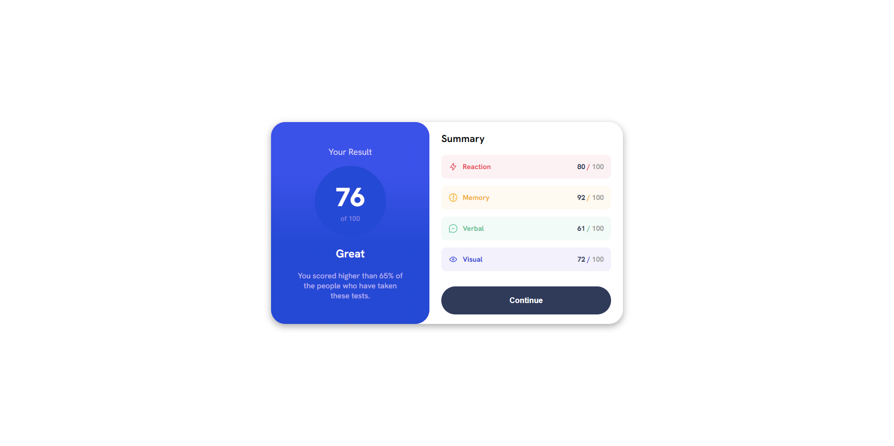

# Frontend Mentor - Results summary component solution

This is a solution to the [Results summary component challenge on Frontend Mentor](https://www.frontendmentor.io/challenges/results-summary-component-CE_K6s0maV). Frontend Mentor challenges help you improve your coding skills by building realistic projects.

## Table of contents

- [Overview](#overview)
  - [The challenge](#the-challenge)
  - [Screenshot](#screenshot)
  - [Links](#links)
- [My process](#my-process)
  - [Built with](#built-with)
- [Author](#author)
- [Acknowledgments](#acknowledgments)

## Overview

### The challenge

Users should be able to:

- View the optimal layout for the interface depending on their device's screen size
- See hover and focus states for all interactive elements on the page

### Screenshot

### Links

- Solution URL: [Website](https://www.frontendmentor.io/solutions/results-summary-component-html-and-css-only-w80ZcNcUTg)
- Live Site URL: [Website](https://lost50u1.github.io/results-summary-component-main/)

## My process

### Built with

- Semantic HTML5 markup
- CSS custom properties
- Mobile-first workflow
- CSS grid
- CSS flexbox

## Author

- Website - [Biruk Moges](https://lost50u1.github.io/)
- Frontend Mentor - [@lost50U1](https://www.frontendmentor.io/profile/lost50U1)
- Twitter - [@cc64e15cb0f543a](https://www.twitter.com/@cc64e15cb0f543a)

## Acknowledgments

I used https://www.freecodecamp.org website as a guide to do the project and it have many useful tutorials i used for this project.
